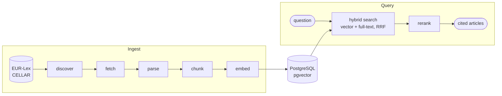

# RegRag

[](https://github.com/callumfm/regrag/actions/workflows/ci.yml)
[](LICENSE)

A retrieval-augmented question answering system over EU maritime emissions law,
where every answer cites the article it came from.

Shipping companies trading in Europe now answer to two regulations, [FuelEU
Maritime](https://eur-lex.europa.eu/legal-content/EN/TXT/?uri=CELEX:32023R1805)
and [MRV](https://eur-lex.europa.eu/legal-content/EN/TXT/?uri=CELEX:32015R0757),
plus the delegated and implementing acts made under them. The text is long,
amended often, and cross-references itself constantly. RegRag keeps a current
copy of that corpus and answers questions against it, returning the exact
articles it relied on rather than a paraphrase to take on trust.

## How it works



- **Discovery** queries CELLAR for every act with FuelEU or MRV as its legal
  basis, then resolves each to its latest consolidated version by CELEX number.
- **Ingestion** runs incrementally: unchanged documents are neither
  re-downloaded nor re-embedded, so keeping the corpus current is cheap.
- **Retrieval** fuses a vector leg and a full-text leg with Reciprocal Rank
  Fusion inside one SQL query, then reranks with a cross-encoder. Stored
  cross-references let a hit be followed to the article it cites.

Design notes for each ingestion stage are in
[`backend/app/ingestion/README.md`](backend/app/ingestion/README.md).

## Layout

| Directory                | Contents                                                     |
| ------------------------ | ------------------------------------------------------------ |
| [`backend/`](backend/)   | Ingestion pipeline and retrieval API (FastAPI, SQLAlchemy)   |
| [`frontend/`](frontend/) | User interface (React, TanStack, Tailwind)                   |

## Status

Ingestion and retrieval are complete and tested against the live corpus. The
answer generation step and the chat interface are in progress.

## Quickstart

```bash
cd backend
cp .env.example .env.dev      # then set VOYAGE_API_KEY
docker compose up -d db
uv sync && uv run alembic upgrade head
uv run ingest fueleu          # download, parse and embed one topic
uv run retrieve "who must surrender FuelEU compliance balance"
```

Setup in full, including the API and frontend, is in each package's README.
